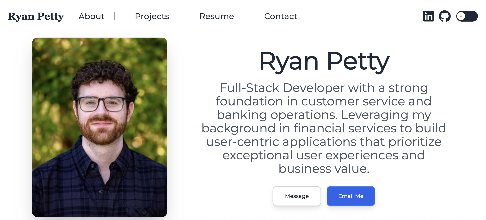

# 🚀 Ryan Petty's Portfolio

  

- **Portfolio**: [View Live Site](https://ryebread5555.github.io/Portfolio)

## 📋 Table of Contents

- [About](#about)
- [Features](#features)
- [Technologies Used](#technologies-used)
- [Contact](#contact)
- [License](#license)

## 🎯 About

A modern, responsive portfolio website showcasing my work as a Full-Stack Developer. Built with React and featuring a clean, professional design with dark/light mode toggle, smooth animations, and interactive elements. The portfolio highlights my background in financial services and my transition into web development, emphasizing user-centric applications and exceptional user experiences.

## 🚀 Features

- **Responsive Navigation**
- **Theme Switching**
- **Interactive Background**
- **Project Showcase**
- **Contact Form**
- **Resume Integration**
- **Social Links**
- **Smooth Animations**

## 🛠️ Technologies Used

### Frontend Technologies
- **React 18.3.1** 
- **JavaScript (ES6+)** 
- **HTML5** 
- **CSS3** 

### Styling & UI
- **Tailwind CSS 3.4.17** 
- **Framer Motion 12.12.1** 
- **React Icons 4.12.0** 
- **Google Fonts** - Typography (Montserrat & Quicksand)

### Build Tools & Development
- **Vite 6.3.5**
- **PostCSS 8.5.6** 
- **Autoprefixer 10.4.21**

### Additional Libraries
- **React Hook Form 7.44.3**
- **React Scroll 1.9.3** 
- **EmailJS 4.0.2** 
- **React Anchor Link Smooth Scroll 1.0.12**
### Deployment
- **GitHub Pages** 

## 📞 Contact

Have questions about this project or interested in collaborating?

- **GitHub**: [@Ryebread5555](https://github.com/Ryebread5555)
- **Email**: [rypetty55@gmail.com](mailto:rypetty55@gmail.com)
- **LinkedIn**: [Connect with me](https://linkedin.com/in/ryan-petty-dev)

Feel free to reach out for any questions, feedback, or opportunities!

## 📄 License

This project is licensed under the MIT License - see the [LICENSE](https://opensource.org/licenses/MIT) file for details.

---

  
Built with ❤️ by Ryan Petty

